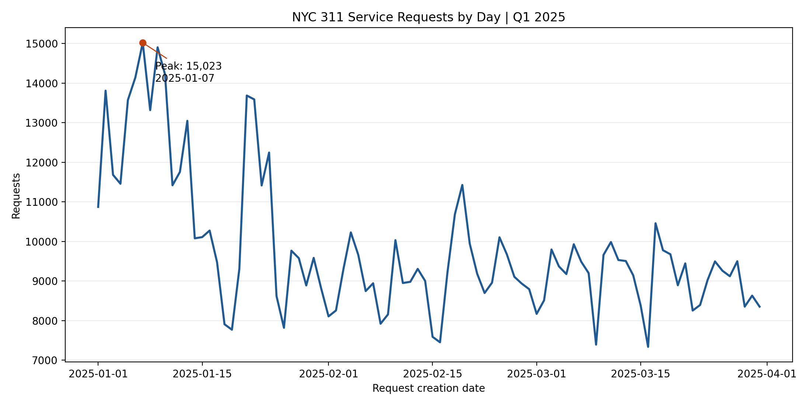
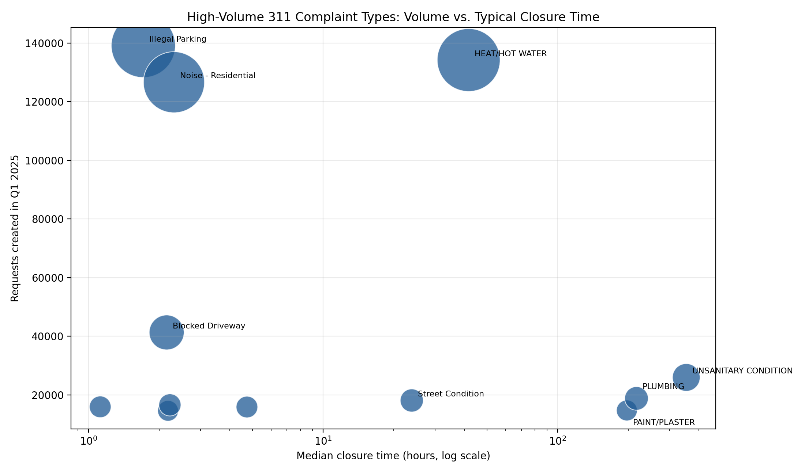
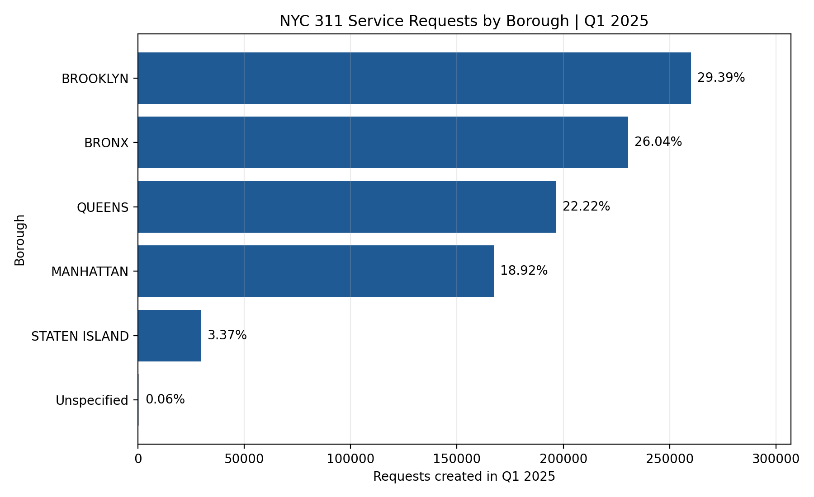

# NYC 311 Service Operations Analytics

## Overview

This is an independent portfolio project using publicly available NYC Open Data. It focuses on non-emergency NYC 311 service requests and is not affiliated with the City of New York or any previous employer.

## Business Objective

This project examines request volume, service-request mix, closure activity, and resolution time across complaint types, responsible agencies, and boroughs.

The results will describe operational patterns rather than rank agencies, because different agencies handle requests with different levels of complexity.

## Data Scope

- Source: [NYC 311 Service Requests from 2020 to Present](https://data.cityofnewyork.us/resource/erm2-nwe9.json)
- Analysis period: January 1, 2025 through March 31, 2025
- Extracted records: 884,765
- Fields: 13 public operational fields, including request timestamps, agency, complaint type, status, borough, and channel
- Extraction completed: September 22, 2026

See [data source notes](docs/data_source.md) and the [full data-quality report](docs/data_quality.md).

## Key Findings

- Q1 2025 contained 884,765 requests, or about 9,831 per day. The observed daily peak was January 7 with 15,023 requests.
- Brooklyn (29.39%), Bronx (26.04%), and Queens (22.22%) accounted for 77.65% of all requests. These are request-volume shares, not population-adjusted service-performance measures.
- Illegal Parking (15.73%), HEAT/HOT WATER (15.17%), and Noise - Residential (14.31%) were the three largest complaint types, together representing about 45% of requests.
- Complaint types have materially different closure-time profiles. High-volume parking and noise requests typically close in hours, while housing-condition categories can have median durations measured in days and substantially longer tails.
- In the September 22, 2026 extraction snapshot, 7,484 records (0.85%) had a status other than `Closed`. This is a current-status snapshot, not a historical Q1 backlog measure.

## Figures







## Analytical Safeguards

- Requests are downloaded with deterministic keyset pagination on `created_date` and `unique_key`, then validated for duplicate keys and batch-boundary errors.
- `resolution_hours` is calculated only for records with valid non-negative created-to-closed durations: 874,285 records meet this condition.
- `due_date` is missing for 99.53% of records and represents an expected agency update date rather than a closure deadline; it is not used for SLA or priority claims.
- Agency comparisons are interpreted in the context of complaint mix and workflow complexity.

## Reproduce the Overview

After obtaining the ignored local data files, rerun the overview and figures with:

```bash
python src/analyze_overview.py
python src/create_charts.py
```

The scripts save derived tables under `data/processed/overview/` and figures under `reports/figures/`.

## Data Policy

All factual analysis will use documented public data. Any future synthetic demonstration will be stored separately and clearly labeled, and will not be mixed with public data.
