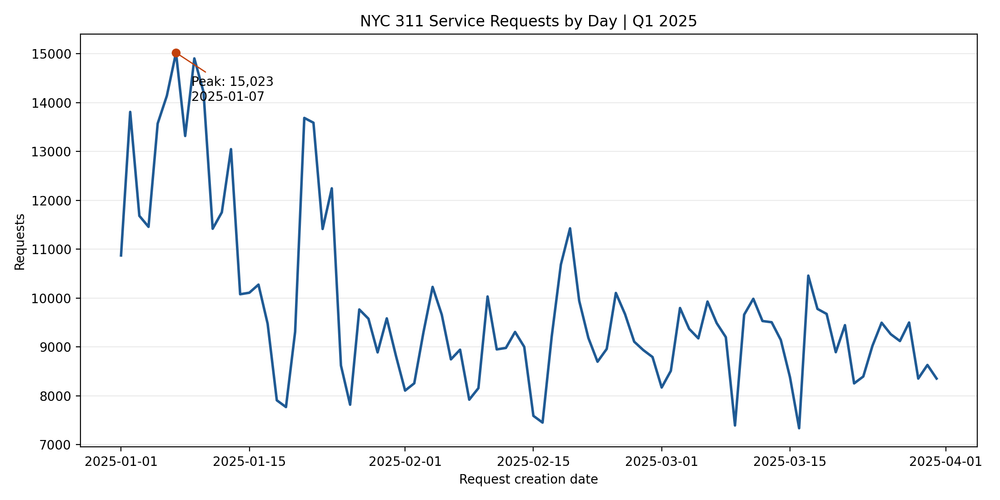
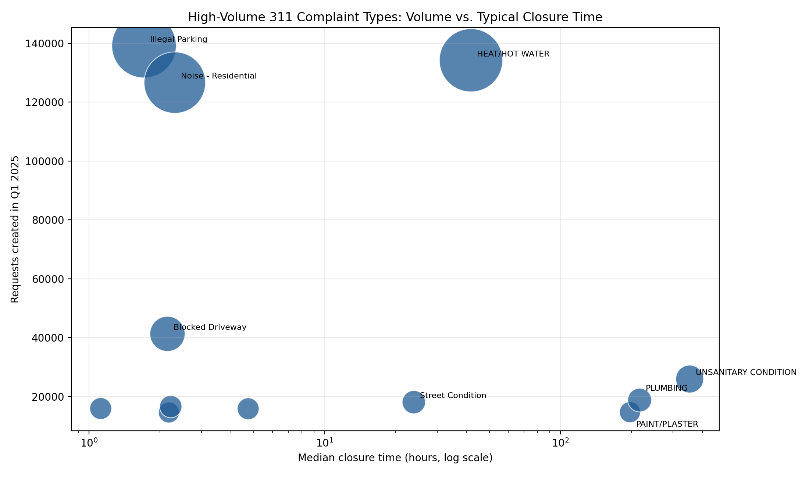
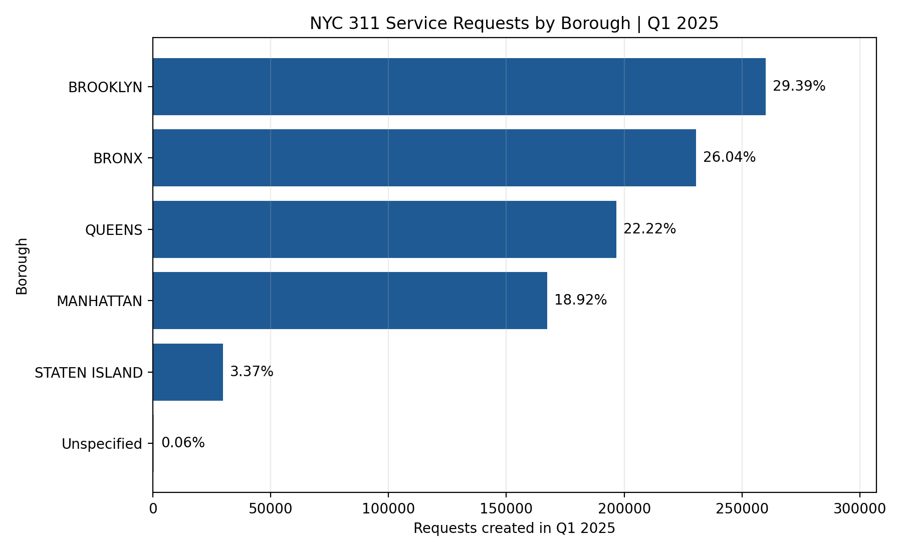
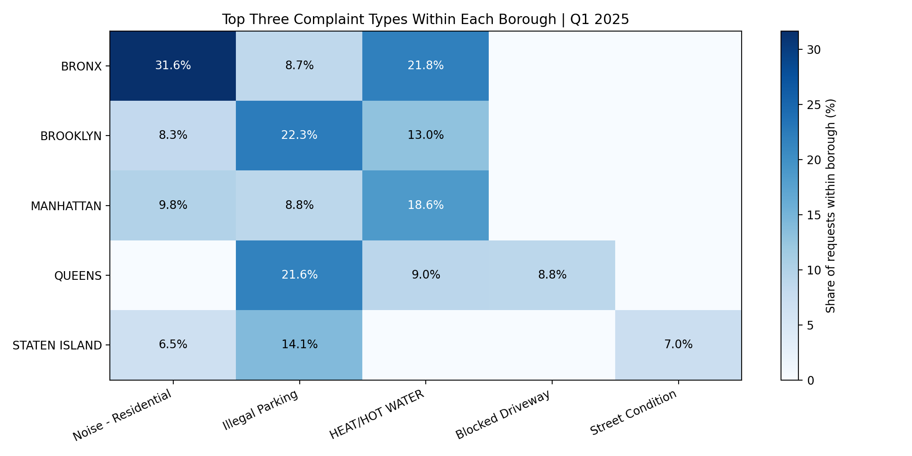

# NYC 311 Service Operations Analytics

## Overview

This portfolio project analyzes NYC 311 service requests created in Q1 2025 using public NYC Open Data.

## Questions explored

I looked at request volume, request mix, closure activity, and resolution time across complaint types, agencies, and boroughs.

The goal is to describe patterns in the public records, not to rank agencies that handle different kinds of work.

## Data Scope

- Source: [NYC 311 Service Requests from 2020 to Present](https://data.cityofnewyork.us/resource/erm2-nwe9.json)

- Analysis period: January 1, 2025 through March 31, 2025
- Extracted records: 884,765
- Fields: 13 public operational fields, including request timestamps, agency, complaint type, status, borough, and channel
- Extraction completed: September 22, 2026

See [data source notes](docs/data_source.md) and the [full data-quality report](docs/data_quality.md).

## Key Findings

- Q1 2025 contained 884,765 requests, or about 9,831 per day. The observed daily peak was January 7 with 15,023 requests.
- Brooklyn (29.39%), Bronx (26.04%), and Queens (22.22%) accounted for 77.65% of all requests. These are request-volume shares, not population-adjusted service-performance measures.
- Illegal Parking (15.73%), HEAT/HOT WATER (15.17%), and Noise - Residential (14.31%) were the three largest complaint types, together representing about 45% of requests.
- Complaint types have materially different closure-time profiles. High-volume parking and noise requests typically close in hours, while housing-condition categories can have median durations measured in days and substantially longer tails.
- In the September 22, 2026 extraction snapshot, 7,484 records (0.85%) had a status other than `Closed`. This is a current-status snapshot, not a historical Q1 backlog measure.

## Figures









## Analysis choices

- I used Q1 2025 to keep the dataset manageable while still covering a full three-month period.
- I report median and 90th-percentile closure times because averages can be pulled upward by unusually long cases.
- I left requests with negative calculated durations out of resolution-time summaries and documented them in the data-quality notes.

## Data checks and limitations

- Requests were downloaded with `created_date` and `unique_key` pagination, then checked for duplicate records.
- Closure time is calculated only when the difference from `created_date` to `closed_date` is valid and non-negative.
- `due_date` is not used to judge SLA performance, and agencies are not ranked directly by closure time.

## Reproduce the Overview

After obtaining the ignored local data files, rerun the overview and figures with:

```bash
python src/analyze_overview.py
python src/create_charts.py
```

The scripts save derived tables under `data/processed/overview/` and figures under `reports/figures/`.

## Operational Interpretation

See [what the results suggest](docs/business_recommendations.md) for ways these patterns could be used.
